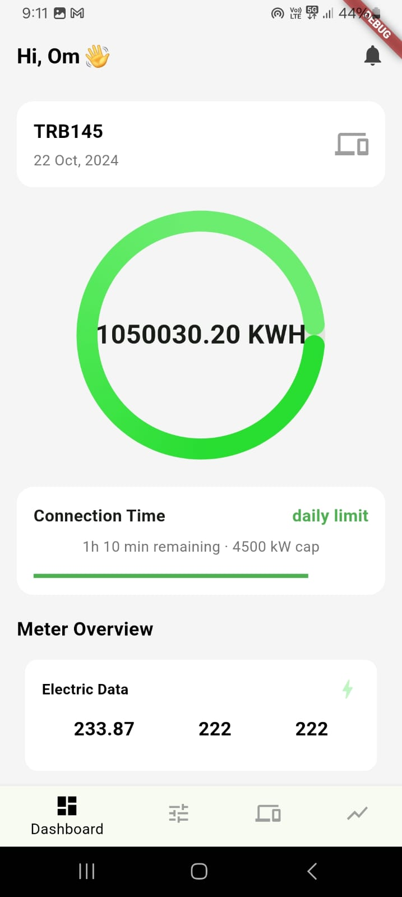
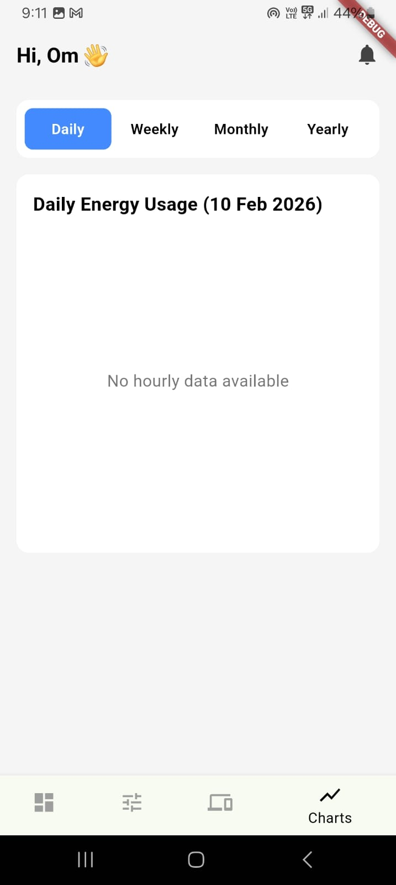

# Smart Meter App – IoT Energy Monitor ⚡

**Tech Stack:** Flutter | Firebase | AWS IoT Core | MQTT | Python  

This application is a real-time IoT based energy monitoring system that displays live smart-meter data on a Flutter mobile app. The system collects power consumption values from a smart meter device, sends them via MQTT to AWS IoT Core, processes them using Python services, and updates Firebase in real time — which is reflected instantly in the Flutter UI.

  

  

---

## 🚀 Features

- 📡 **Real-Time Data Streaming** from smart meter  
- ☁️ MQTT communication via **AWS IoT Core**  
- 🔥 Live synchronization using **Firebase Realtime Database / Firestore**  
- 📱 Cross-platform mobile app built with **Flutter**  
- 📊 Displays:
  - Voltage  
  - Current  
  - Power Consumption  
  - Energy Units  
- 📈 Dynamic UI updates without refresh  
- Secure device authentication using AWS certificates

---

## 🧠 How It Works (System Flow)

1. **Smart Meter Device**
   - Reads electrical parameters (voltage, current, power, units)
   - Sends data via MQTT protocol

2. **AWS IoT Core**
   - Receives MQTT messages from the device  
   - Manages device authentication & topics  
   - Forwards data to backend services

3. **Python Middleware**
   - Subscribes to MQTT topics  
   - Processes and formats incoming data  
   - Pushes structured data to Firebase

4. **Firebase → Flutter App**
   - Firebase acts as real-time backend  
   - Flutter listens to Firebase streams  
   - UI updates instantly whenever new meter data arrives

---

## 📱 App Functionality

- Live dashboard showing:
  - Current power usage  
  - Daily energy consumption  
  - Historical trends  
- Auto refresh using Firebase listeners  
- Error handling for device offline state  
- Clean and responsive UI

---

## 🛠 Tech Architecture

